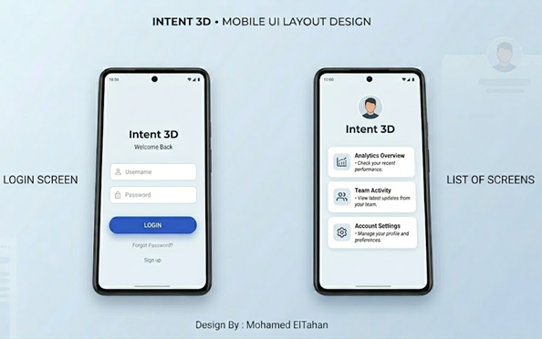
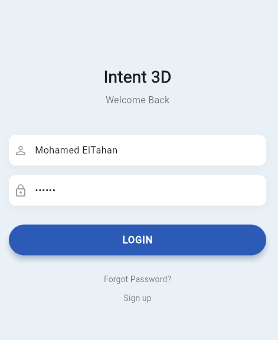
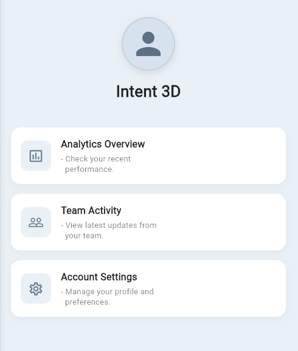

<div align="center">

# 🎨 Intent 3D Basic UI


<br/>

<br/>

<i>A minimalist, clean 2-screen mobile application consisting of a Login Screen and a Home Screen.</i>
<br/>

</div>

---

## ✨ Features

- 🔐 **Modern Login Screen**: Clean minimalist UI with intuitive input fields and a prominent call-to-action.
- 🏠 **Home Dashboard**: Welcoming user profile avatar with a clean, vertically stacked list of interactive cards.
- 🎨 **Material 3 Design**: Fully leverages Flutter's latest Material 3 theming for dynamic and beautiful aesthetics.
- 🧩 **Modular Structure**: Codebase is split cleanly into discrete screen files for high maintainability.

<br/>

## 🚀 Getting Started

Follow these steps to run this project on your local machine.

### Prerequisites
- **Flutter SDK** (`>=3.0.0`)
- **Dart SDK**
- Android Studio / VS Code

### Installation

1. **Navigate to the project directory**:
   ```bash
   cd basic_ui
   ```

2. **Get dependencies**:
   ```bash
   flutter pub get
   ```

3. **Run the app**:
   ```bash
   flutter run
   ```

<br/>

## 📂 Project Structure

```text
lib/
├── main.dart               # Entry point and Theme configuration
└── screens/
    ├── login_screen.dart   # Minimalist Login UI
    └── home_screen.dart    # Dashboard with Profile & Cards
```

<br/>

## 📸 App Preview

<div align="center">
  <table>
    <tr>
      <td align="center"><b>Login Screen</b></td>
      <td align="center"><b>Home Screen</b></td>
    </tr>
    <tr>
      <td></td>
      <td></td>
    </tr>
  </table>
</div>

<br/>

## 🛠 Built With

* [**Flutter**](https://flutter.dev/) - The UI Toolkit for building beautiful, natively compiled applications.
* [**Dart**](https://dart.dev/) - The programming language optimized for UI.

---
<p align="center">Made with ❤️ for the Intent 3D Project</p>
